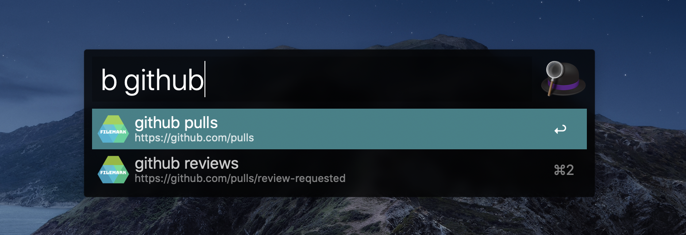
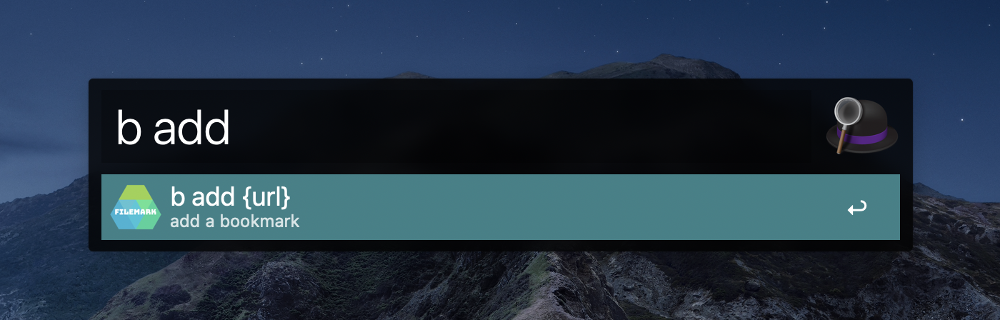

# Filemark - Alfred Workflow for universal bookmark manager


## Installation

1. make sure you have `jq` installed, otherwise `brew install jq`.
1. download [Filemark.alfredworkflow](Filemark.alfredworkflow) file.
3. update environment variable `DIR_PATH` ie. `/Users/username/Dropbox`

## Usage

#### Search
Search through all of your bookmarks by typing a keyword.
```
b {keyword}
```


#### Add a bookmark
Adding an url followed by the name or keyword.
```
b add {url}
# hit enter
{keyword or name you can remember}
```


#### Edit
Edit command opens the source text file.
```
b edit
```

#### Backup
Backup command will duplicate the source file with name of `backup_{filename}`
```
b backup
```
